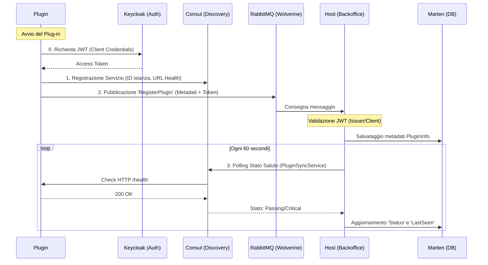

# Documentazione Sistema Plug-in Pollon

Questa documentazione descrive il sistema di registrazione e monitoraggio distribuito per i plug-in del CMS Pollon.

## 🏗️ Architettura del Sistema

Il sistema utilizza un approccio ibrido:
- **Keycloak**: Per l'autenticazione tramite Client Credentials Flow.
- **Wolverine + RabbitMQ**: Per lo scambio dei metadati di registrazione protetti da JWT.
- **Consul**: Per il Service Discovery e l'health monitoring attivo.

### Diagramma di Flusso

## 🔐 Sicurezza e Identità Certificata

Il sistema implementa un modello di **Identità Certificata** per prevenire spoofing e registrazioni non autorizzate.

1.  **Identity Provisioning**: L'amministratore crea un'identità per il plugin tramite il Backoffice Web. Questo genera un `client_id` (es. `plugin-newsletter-123`) e un `client_secret` in Keycloak tramite un account amministrativo privilegiato (`pollon-identity-manager`).
2.  **Autenticazione**: Il plugin utilizza queste credenziali per ottenere un token JWT tramite il flow `client_credentials`.
3.  **Enforcement dell'Identità**: Il `PluginHandler` nel Backoffice valida il token e **impone** che il `client_id` contenuto nel JWT corrisponda esattamente all'ID dichiarato nel messaggio di registrazione. Se un plugin tenta di registrarsi con un ID diverso da quello certificato dal token, la registrazione viene rifiutata.
4.  **Stabilità**: Poiché il `client_id` è unico e immutabile, le associazioni tra plugin e Content Type (`EnabledContentTypes`) rimangono stabili nel tempo.

## 🚀 Pipeline di Registrazione

1.  **Dichiarazione Infrastrutturale (Consul)**: 
    Il plug-in si registra su Consul. Questo permette all'infrastruttura di conoscere l'indirizzo fisico e la porta del plug-in. 
    
2.  **Annuncio Metadati (Wolverine)**:
    Il plug-in invia un messaggio `RegisterPlugin` contenente:
    - **ID univoco** (deve coincidere con il `client_id` di Keycloak)
    - Nome visualizzato
    - Versione
    - Descrizione
    - URL di Health Check
    - **Access Token (JWT)**
    - Elenco dei **Supported Content Types** (i tipi di contenuto che il plugin è in grado di processare)

## 🩺 Monitoraggio Salute (Health Check)

Il monitoraggio è di tipo **Active-Pull** da parte dell'Host:
- **Plug-in**: Espone un endpoint `/health` (standard ASP.NET Core Health Checks).
- **Consul**: Interroga l'endpoint ogni 10 secondi.
- **Host (Service Sync)**: Il `PluginSyncService` interroga periodicamente Consul. 
  - Se un plugin è presente e sano, lo marca come `Online`.
  - Se un plugin scompare da Consul, viene marcato come `Offline` nel database Marten, ma **non viene rimosso**. Questo preserva le impostazioni di configurazione dell'utente (associazioni ai Content Type) tra un riavvio e l'altro.

## 💻 Componenti Principali

- **`KeycloakTokenClient.cs`**: Gestisce il recupero e il caching del token OAuth2.
- **`PluginRegistrationService.cs`**: Gestisce la registrazione e de-registrazione automatica del plug-in.
- **`PluginSyncService.cs`**: Servizio di background nel Backoffice che allinea lo stato del database con la realtà di Consul.
- **`PluginHandler.cs`**: Gestore Wolverine che valida il token e riceve i metadati di registrazione.

## ⚙️ Esecuzione in Aspire

Anche se i plug-in possono essere eseguiti standalone, la modalità raccomandata è all'interno dell'orchestrazione .NET Aspire:
1. I plug-in condividono la rete interna e possono usare gli indirizzi DNS (es. `http://keycloak:8080`).
2. Le porte vengono gestite automaticamente.
3. È possibile spegnere/accendere i plug-in direttamente dalla dashboard Aspire per testare la resilienza.
