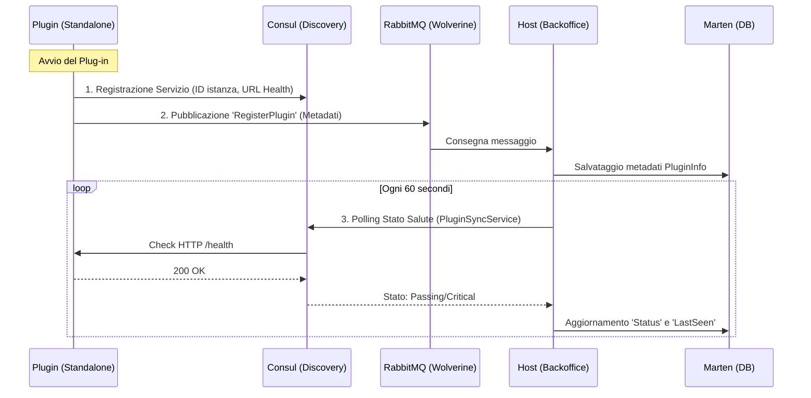

# Documentazione Sistema Plug-in Pollon

Questa documentazione descrive il sistema di registrazione e monitoraggio distribuito per i plug-in del CMS Pollon.

## 🏗️ Architettura del Sistema

Il sistema utilizza un approccio ibrido:
- **Wolverine + RabbitMQ**: Per lo scambio dei metadati iniziali (nome, versione, descrizione).
- **Consul**: Per il Service Discovery e l'health monitoring attivo.

### Diagramma di Flusso

## 🚀 Pipeline di Registrazione

1.  **Dichiarazione Infrastrutturale (Consul)**: 
    Il plug-in si registra su Consul. Questo permette all'infrastruttura di conoscere l'indirizzo fisico e la porta del plug-in. In modalità standalone, viene usato l'alias `host.docker.internal` per permettere a Consul (in Docker) di comunicare con il plug-in sull'host.
    
2.  **Annuncio Metadati (Wolverine)**:
    Il plug-in invia un messaggio `RegisterPlugin` contenente:
    - ID univoco (es. `plugin-example-01`)
    - Nome visualizzato
    - Versione
    - Descrizione
    - URL di Health Check

## 🩺 Monitoraggio Salute (Health Check)

Il monitoraggio è di tipo **Active-Pull** da parte dell'Host:
- **Plug-in**: Espone un endpoint `/health` (standard ASP.NET Core Health Checks).
- **Consul**: Interroga l'endpoint ogni 10 secondi.
- **Host (Service Sync)**: Il `PluginSyncService` interroga periodicamente Consul per tutti i servizi denominati `pollon-plugin` e aggiorna lo stato nel database Marten.

## 💻 Componenti Principali

- **`PluginRegistrationService.cs`**: Gestisce la registrazione e de-registrazione automatica del plug-in.
- **`PluginSyncService.cs`**: Servizio di background nel Backoffice che allinea lo stato del database con la realtà di Consul.
- **`PluginHandler.cs`**: Gestore Wolverine che riceve i metadati di registrazione.

## ⚙️ Configurazione Standalone

Per avviare un plug-in standalone:
1. Assicurarsi di aver configurato `CONSUL_URL`.
2. Verificare che le porte in `launchSettings.json` non confliggano con Aspire (raccomandate: 5500+).
3. Eseguire `dotnet run` nella cartella del plug-in.
