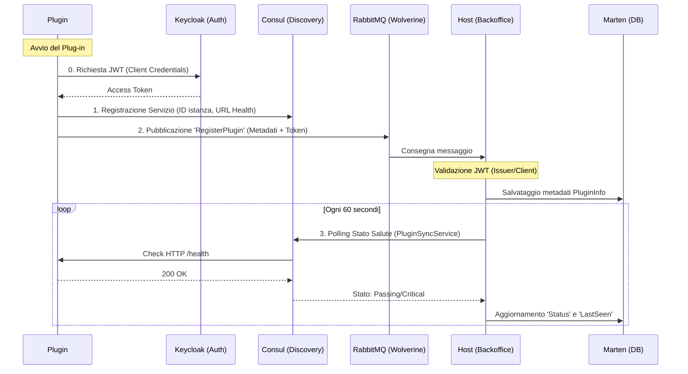

# Documentazione Sistema Plug-in Pollon

Questa documentazione descrive il sistema di registrazione e monitoraggio distribuito per i plug-in del CMS Pollon.

## 🏗️ Architettura del Sistema

Il sistema utilizza un approccio ibrido:
- **Keycloak**: Per l'autenticazione tramite Client Credentials Flow.
- **Wolverine + RabbitMQ**: Per lo scambio dei metadati di registrazione protetti da JWT.
- **Consul**: Per il Service Discovery e l'health monitoring attivo.

### Diagramma di Flusso

## 🔐 Sicurezza e Autenticazione

Tutte le richieste di registrazione devono essere autenticate per prevenire registrazioni di plug-in non autorizzati.

1.  **Ottimizzazione Token**: All'avvio, il plug-in utilizza un `KeycloakTokenClient` per ottenere un token JWT da Keycloak utilizzando il flow `client_credentials`.
2.  **Iniezione del Token**: Il token viene incluso nel messaggio di registrazione `RegisterPlugin`.
3.  **Validazione**: Il `PluginHandler` nel Backoffice valida il token contro l'Issuer di Keycloak prima di processare la registrazione. In ambiente di sviluppo (Aspire), l'Issuer viene risolto dinamicamente tramite Consul o Connection Strings.

## 🚀 Pipeline di Registrazione

1.  **Dichiarazione Infrastrutturale (Consul)**: 
    Il plug-in si registra su Consul. Questo permette all'infrastruttura di conoscere l'indirizzo fisico e la porta del plug-in. 
    
2.  **Annuncio Metadati (Wolverine)**:
    Il plug-in invia un messaggio `RegisterPlugin` contenente:
    - ID univoco (es. `plugin-example-01`)
    - Nome visualizzato
    - Versione
    - Descrizione
    - URL di Health Check
    - **Access Token (JWT)**

## 🩺 Monitoraggio Salute (Health Check)

Il monitoraggio è di tipo **Active-Pull** da parte dell'Host:
- **Plug-in**: Espone un endpoint `/health` (standard ASP.NET Core Health Checks).
- **Consul**: Interroga l'endpoint ogni 10 secondi.
- **Host (Service Sync)**: Il `PluginSyncService` interroga periodicamente Consul per tutti i servizi denominati `pollon-plugin` e aggiorna lo stato nel database Marten.

## 💻 Componenti Principali

- **`KeycloakTokenClient.cs`**: Gestisce il recupero e il caching del token OAuth2.
- **`PluginRegistrationService.cs`**: Gestisce la registrazione e de-registrazione automatica del plug-in.
- **`PluginSyncService.cs`**: Servizio di background nel Backoffice che allinea lo stato del database con la realtà di Consul.
- **`PluginHandler.cs`**: Gestore Wolverine che valida il token e riceve i metadati di registrazione.

## ⚙️ Esecuzione in Aspire

Anche se i plug-in possono essere eseguiti standalone, la modalità raccomandata è all'interno dell'orchestrazione .NET Aspire:
1. I plug-in condividono la rete interna e possono usare gli indirizzi DNS (es. `http://keycloak:8080`).
2. Le porte vengono gestite automaticamente.
3. È possibile spegnere/accendere i plug-in direttamente dalla dashboard Aspire per testare la resilienza.
