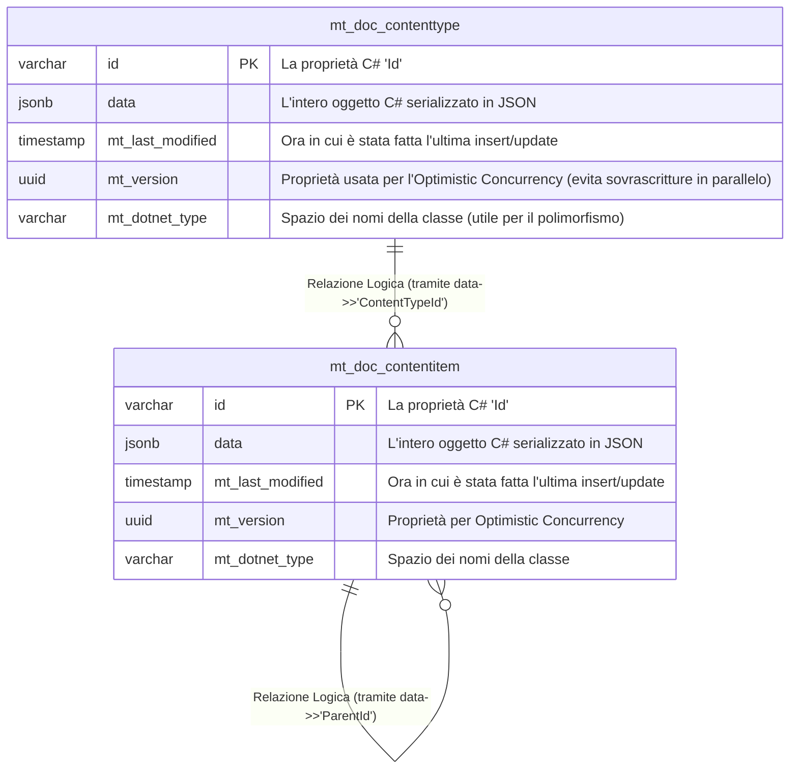

# Funzionamento e Schema del Database con Marten

Marten è una libreria .NET che trasforma uno dei database relazionali più potenti al mondo (PostgreSQL) in un ecosistema a **Documenti** e, opzionalmente, **Event Sourcing** ad altissime prestazioni. Prende l'efficienza solida di Postgres, ma garantisce allo sviluppatore un'esperienza d'uso C# simile ai database NoSQL come MongoDB. 

## Schema Fisico del Database
Essendo un NoSQL basato su Postgres, Marten non crea una tabella per ogni classe del tuo dominio incastonata con centinaia di colonne. Invece, appoggia le tue entità C# come file JSON nativi (usa il tipo `jsonb` di Postgres, ad alta efficienza) all'interno di un core di tabelle base.

Ecco come si presenta il database fisico in background (`mt_doc_contentitem` è il nome che assegna Marten per la classe `ContentItem` ecc.):



## Come gestisce i dati Marten?

### 1. Schema-less e Flessibilità (JSONB)
A differenza dei database relazionali tradizionali (come Entity Framework su SQL Server), Marten permette di evolvere il domain model senza costose migrazioni SQL. Se aggiungi una proprietà a `ContentItem`, PostgreSQL aggiorna semplicemente il blob `jsonb` alla successiva operazione di scrittura. Questo elimina il rischio di lock sulla tabella durante l'I/O e accelera drasticamente il ciclo di sviluppo.

### 2. Query ad Alte Prestazioni (Indexing & LINQ)
Marten traduce le query LINQ in C# direttamente in query SQL ottimizzate per il tipo JSONB.
Esempio di query nel Backoffice:
```csharp
var id = "parent-123";
_session.Query<ContentItem>().Where(x => x.ParentId == id).ToListAsync();
```
Traduzione SQL nativa:
```sql
SELECT d.id, d.data, d.mt_last_modified, d.mt_version
FROM public.mt_doc_contentitem d
WHERE d.data ->> 'ParentId' = 'parent-123';
```
PostgreSQL è in grado di indicizzare campi specifici all'interno del JSON (Functional Indexes), garantendo tempi di risposta inferiori al millisecondo anche con milioni di record.

### 3. Batched Query (Risoluzione del Problema N+1)
Per ottimizzare il caricamento della gerarchia nel Backoffice, utilizziamo le **Batched Queries**. Questo permette di raggruppare più interrogazioni in un unico round-trip di rete.
Invece di eseguire query separate per il Genitore e per i Figli (rischiando latenze di rete elevate), Marten invia un singolo pacchetto SQL:

```sql
SELECT data FROM mt_doc_contentitem WHERE id = 'padre-123';
SELECT data FROM mt_doc_contentitem WHERE data->>'ParentId' = 'padre-123';
```
I risultati vengono mappati asincronamente sulle variabili C# corrispondenti, abbattendo il tempo totale di esecuzione.

---

### Key takeaways per lo Sviluppatore
- **Transazionalità ACID**: Nonostante il comportamento da NoSQL, Marten garantisce transazioni atomiche e sicure grazie alla robustezza di PostgreSQL.
- **Relazioni Logiche**: Le relazioni parent-child o i dizionari di dati (usati in `EditContentItem`) vengono serializzati direttamente nel campo `data`, evitando complessi SQL JOIN.
- **Evoluzione Continua**: La possibilità di modificare il modello dati in C# senza agire sullo schema fisico rende Pollon ideale per progetti in rapida evoluzione.


### In Breve
- **Sviluppo Rapido**: È potente come MongoDB perché ti libera dal dover fare Migrazioni SQL, Foreign Keys o tabelle multiple complesse.
- **Relazioni**: Le parentela, associazioni C# e `[Dictionary]` che abbiamo implementato in `EditContentItem` vengono serializzati direttamente all'interno della cella `data`. Non ci snodi e incastri di SQL JOINS sfiancanti.
- **Transazionale ACID e SQL**: A differenza di altri NoSQL, siccome i dati sono dentro PostgreSQL in modo sicuro, puoi contare sui rollback atomici (transazioni rigorose) e sfruttare estensioni formidabili come la ricerca Testuale, GIS o CTE ricorsive di SQL se mai servisse.
