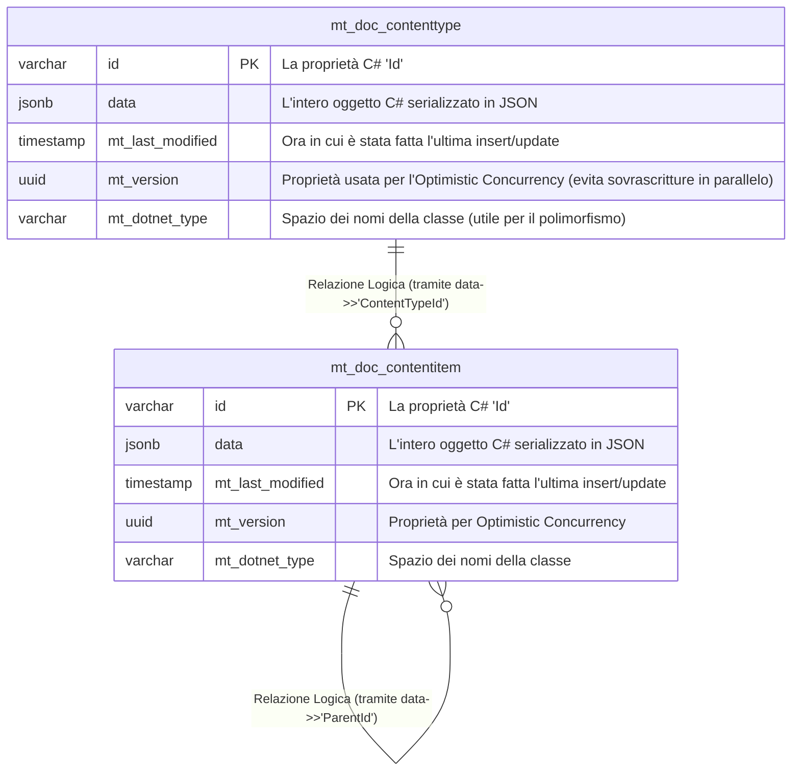

# Funzionamento e Schema del Database con Marten

Marten è una libreria .NET che trasforma uno dei database relazionali più potenti al mondo (PostgreSQL) in un ecosistema a **Documenti** e, opzionalmente, **Event Sourcing** ad altissime prestazioni. Prende l'efficienza solida di Postgres, ma garantisce allo sviluppatore un'esperienza d'uso C# simile ai database NoSQL come MongoDB. 

## Schema Fisico del Database
Essendo un NoSQL basato su Postgres, Marten non crea una tabella per ogni classe del tuo dominio incastonata con centinaia di colonne. Invece, appoggia le tue entità C# come file JSON nativi (usa il tipo `jsonb` di Postgres, ad alta efficienza) all'interno di un core di tabelle base.

Ecco come si presenta il database fisico in background (`mt_doc_contentitem` è il nome che assegna Marten per la classe `ContentItem` ecc.):



## Come gestisce i dati Marten?

### 1. Zero Migrazioni e Zero Schema Rigid! 
Se tu domani volessi aggiungere a `ContentItem` un nuovo campo `public string? SEO_Title { get; set; }`, in Entity Framework (SQL Server / Database tradizionali), saresti forzato a fare `Add-Migration`, poi `Update-Database`, aggiungere una colonna "SEO_Title", bloccare l'I/O su chiusure stringenti (lock), ecc.  
Con Marten tu modifichi semplicemente la classe in C#! Al prossimo salvataggio, PostgreSQL aggiorna l'intero malloppo JSON `data` per includere quel campo testuale in tutta scioltezza.

### 2. LINQ supportato a livello di Engine JSON
Quando fai _una_ query LINQ strutturata su C# come questa nel Backoffice:
```csharp
var id = "my-parent-id";
_session.Query<ContentItem>().Where(x => x.ParentId == id).ToListAsync();
```

Marten la traduce, usando la potenza del JSONB (`jsonb`) PostgreSQL, nativamente così:
```sql
SELECT d.id, d.data, d.mt_last_modified, d.mt_version
FROM public.mt_doc_contentitem d
WHERE d.data ->> 'ParentId' = 'my-parent-id';
```
Questo avviene *estremamente in fretta*: Postgres è molto fiero e performante sui suoi campi JSONB. Puoi perfino far creare a Marten indici SQL nativi estraendo singoli campi dal JSON e indicizzandoli pesantemente! (ad es. Indice sul ParentId).

### 3. Batched Query (Quello che abbiamo implementato noi per l'N+1)
Con le Batched Queries, Marten raggruppa letteralmente N query SQL all'inizio, apre una singola connessione a PostgreSQL, esegue le interrogazioni sotto lo stesso round-trip e ti restituisce tutti i Set di Ritorno in parallelo.
Nel nostro caso, invia un *unico pacchetto SQL* simile a questo:

```sql
SELECT data FROM mt_doc_contentitem WHERE id = 'padre-123';
SELECT data FROM mt_doc_contentitem WHERE data->>'ParentId' = 'padre-123';
```

E ti mappa i task in C# completati in un solo colpo solo, per evitare latenze di rete. 

---

### In Breve
- **Sviluppo Rapido**: È potente come MongoDB perché ti libera dal dover fare Migrazioni SQL, Foreign Keys o tabelle multiple complesse.
- **Relazioni**: Le parentela, associazioni C# e `[Dictionary]` che abbiamo implementato in `EditContentItem` vengono serializzati direttamente all'interno della cella `data`. Non ci snodi e incastri di SQL JOINS sfiancanti.
- **Transazionale ACID e SQL**: A differenza di altri NoSQL, siccome i dati sono dentro PostgreSQL in modo sicuro, puoi contare sui rollback atomici (transazioni rigorose) e sfruttare estensioni formidabili come la ricerca Testuale, GIS o CTE ricorsive di SQL se mai servisse.
