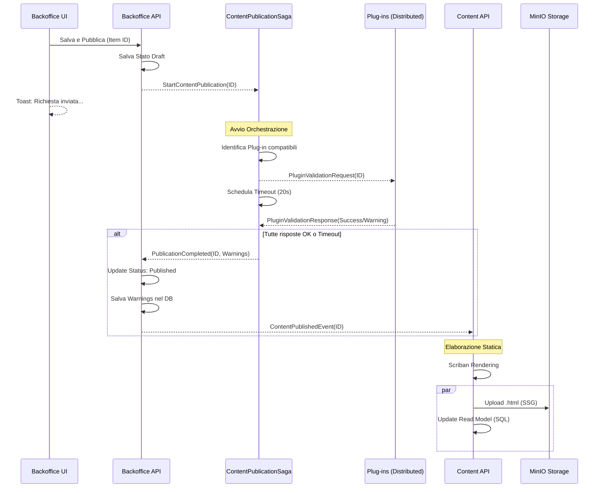

# Ciclo di Vita della Pubblicazione in Pollon

Questo documento descrive il flusso end-to-end di come un contenuto viene creato nel Backoffice, processato tramite una Saga di orchestrazione con validazione distribuita via plug-in, e infine reso disponibile nel Frontend.

## Panoramica del Flusso

Il sistema di pubblicazione di Pollon è asincrono e guidato da una **Saga** (Stateful Orchestrator) gestita tramite **Wolverine** e persistita su **Marten**.

### 1. Fase di Innesco (Backoffice API)
Quando un utente preme "Salva e Pubblica" nel Backoffice:
1.  Il `ContentItemService` salva i dati nel database PostgreSQL (Marten).
2.  Lo stato del contenuto viene impostato (o mantenuto) a `Draft` per evitarne la visualizzazione prematura.
3.  Viene inviato il messaggio di comando `StartContentPublication(Id, ContentType)`.

### 2. Fase di Orchestrazione (ContentPublicationSaga)
La Saga intercetta il comando e gestisce l'intero ciclo di vita della validazione:
1.  **Selezione Plug-in**: La Saga interroga il registro dei plug-in online e seleziona solo quelli che supportano il `ContentType` specifico del messaggio.
2.  **Richiesta di Validazione**: Invia un messaggio `PluginValidationRequest` a tutti i plug-in coinvolti tramite il bus (RabbitMQ).
3.  **Gestione Risposte**: I plug-in eseguono la propria logica (SEO, conformità legale, analisi immagini, ecc.) e rispondono con `PluginValidationResponse`.
4.  **Timeout (20s)**: Se uno o più plug-in non rispondono entro 20 secondi, la Saga scatta autonomamente un evento di timeout (`PublicationTimeout`) per evitare blocchi infiniti.
5.  **Aggregazione Warning**: Eventuali fallimenti o timeout dei plug-in non bloccano la pubblicazione (strategia "Publish with Warning") ma vengono registrati come avvisi nel contenuto finale.

### 3. Fase di Finalizzazione (Backoffice API)
Al termine della Saga (ricevute tutte le risposte o scattato il timeout):
1.  Viene emesso il messaggio `PublicationCompleted`.
2.  Un handler dedicato aggiorna il `ContentItem` nel database:
    -   Imposta lo stato a `Published`.
    -   Registra la data di pubblicazione.
    -   Allega la lista completa dei `Warnings` ricevuti dai plug-in.
3.  Viene infine emesso il `ContentPublishedEvent` standard.

### 4. Fase di Elaborazione Delivery (Content API)
Il microservizio `Content.Api` intercetta l'evento finale:
1.  **Rendering**: Se necessario, invoca lo `ScribanTemplateRenderer`.
2.  **SSG**: L'HTML prodotto viene inviato al `MinioStaticStorage`.
3.  **Delivery DB**: I metadati e il testo di ricerca (`SearchText`) vengono salvati nel database SQL dedicato alla lettura.

## Diagramma di Sequenza Aggiornato

## Robustezza e Tolleranza ai Guasti
-   **Strategia con Warning**: I plug-in sono considerati cittadini "non critici" per la disponibilità del servizio. Un loro malfunzionamento aggiunge un warning ma non impedisce al contenuto di andare online.
*   **Persistenza Stato**: La Saga è persistita su Marten, quindi se il BackofficeAPI si riavvia, la Saga riprende esattamente da dove era rimasta una volta ripartito il servizio.
*   **Timeout Deterministico**: Il timeout di 20 secondi garantisce un tempo di risposta massimo prevedibile per l'utente finale.
