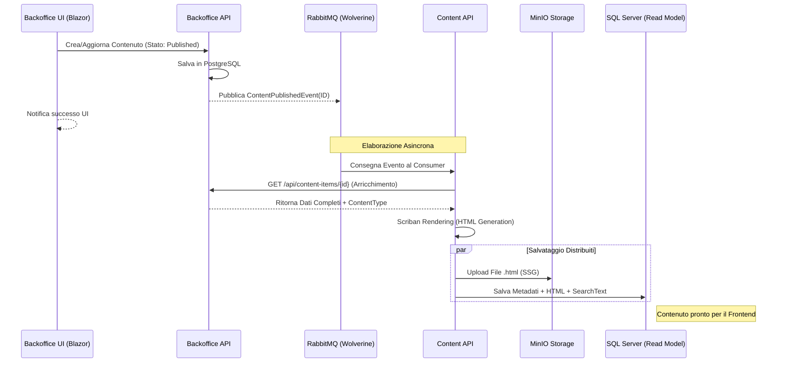
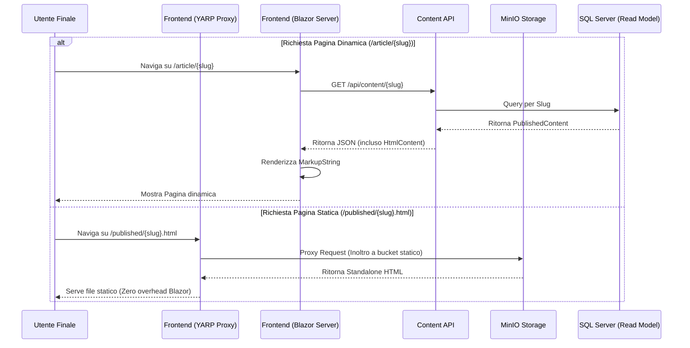

# Ciclo di Vita della Pubblicazione in Pollon

Questo documento descrive il flusso end-to-end di come un contenuto viene creato nel Backoffice, processato e infine reso disponibile nel Frontend attraverso un'architettura guidata dagli eventi (Event-Driven).

## Panoramica del Flusso

Il sistema di pubblicazione di Pollon è completamente asincrono e si basa su RabbitMQ (gestito tramite Wolverine) per la comunicazione tra microservizi.

### 1. Fase di Trigger (Backoffice API)
Quando un utente preme "Salva e Pubblica" nel Backoffice:
1. Il `ContentItemService` salva i dati grezzi nel database PostgreSQL.
2. Viene emesso un evento `ContentPublishedEvent` o `ContentUpdatedEvent` contenente solo l'ID del contenuto.

### 2. Fase di Elaborazione (Content API)
Il microservizio `Content.Api` è in ascolto di questi eventi:
1. **Recupero Dati**: Il consumer chiama il Backoffice API per ottenere i dati completi dell'item e le informazioni sul suo `ContentType`.
2. **Rendering**: Se il tipo di contenuto prevede la modalità `Static` o `Both`, viene invocato lo `ScribanTemplateRenderer`.
3. **SSG (Static Site Generation)**: L'HTML prodotto viene inviato al `MinioStaticStorage`.
4. **Persistenza Delivery**: I metadati, il testo per la ricerca (`SearchText`) e il blocco HTML vengono salvati nel database SQL Server dedicato alla lettura.

## Diagrammi di Sequenza

### Flusso di Pubblicazione Contenuto

### Flusso di Visualizzazione (Frontend + YARP Proxy)

## Reverse Proxy & Ottimizzazione CDN
L'integrazione di **YARP (Yet Another Reverse Proxy)** nel Frontend permette di servire i contenuti direttamente dallo storage ma sotto lo stesso dominio dell'applicazione principale.
- **Vantaggi**: 
    - Coerenza del dominio per SEO e SSL.
    - Facilità di cache: una CDN (es. Cloudflare) può caricare in cache l'intero percorso `/published/*`.
    - Performance: il server Blazor non viene interpellato per il rendering della pagina, riducendo drasticamente l'uso di memoria e CPU.

## Stati e Modalità di Pubblicazione

Il ciclo di vita è influenzato dalla configurazione del **ContentType**:

| Modalità | Azione Content API | Destinazione Principale |
| :--- | :--- | :--- |
| **Headless** | Salva solo JSON | SQL Server (Delivery DB) |
| **Static** | Renderizza HTML e salva file | MinIO Storage |
| **Both** | Esegue SSG e popola API | SQL Server & MinIO |

## Gestione degli Errori e Robustezza
- **Durable Inbox**: Il sistema utilizza il pattern Outbox/Inbox di Wolverine per garantire che nessun evento di pubblicazione vada perso in caso di downtime temporaneo di un servizio.
- **Persistence**: Come configurato in `AppHost.cs`, tutti i database e lo storage statico sono persistenti grazie ai volumi Docker, garantendo la disponibilità dei dati tra i riavvii.
